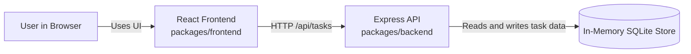
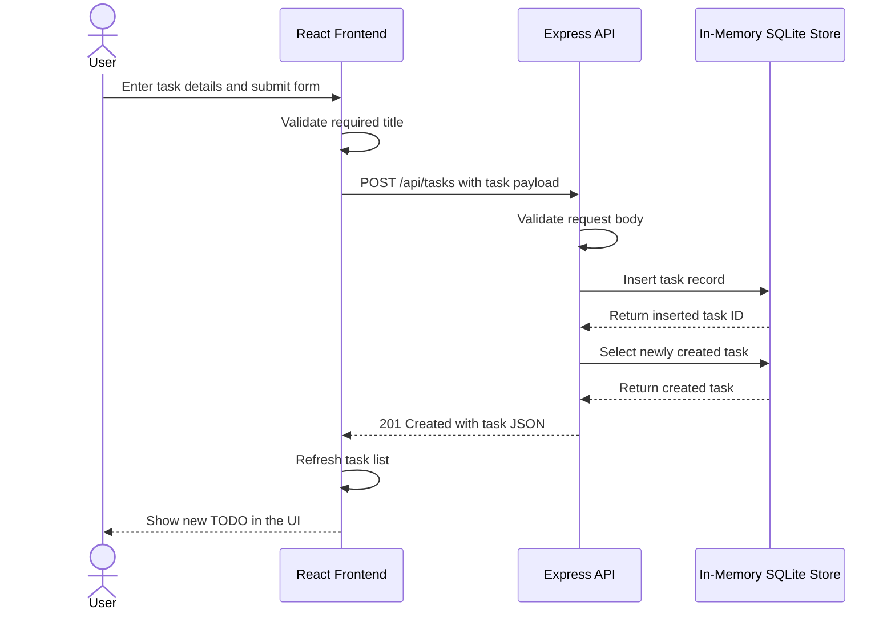

# Cloud Architecture Overview

This monorepo contains a browser-based React frontend, an Express API, and an in-memory data store used by the backend at runtime.

## System Context

## Sequence: Create a TODO

## Notes

- The frontend and backend live in the same npm workspace monorepo.
- The React frontend calls the Express API for task operations.
- The backend uses an in-memory SQLite database, so data is not persisted across server restarts.
